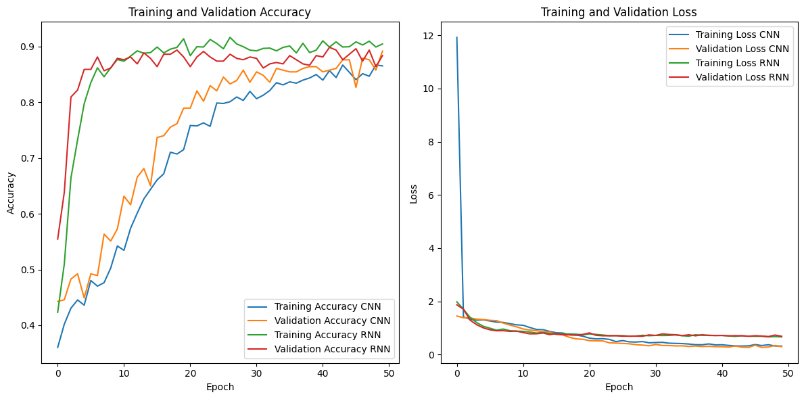

# Audio Classification with CNN and RNN

This project focuses on classifying audio files using Convolutional Neural Networks (CNN) and Recurrent Neural Networks (RNN). The dataset contains various categories of audio files, and we extract MFCC features to train the models. Additionally, a Streamlit app is provided to predict baby cries using the trained models.

## Table of Contents

- [Audio Classification with CNN and RNN](#audio-classification-with-cnn-and-rnn)
  - [Table of Contents](#table-of-contents)
  - [Installation](#installation)
  - [Usage](#usage)
    - [Model Training](#model-training)
    - [Streamlit App](#streamlit-app)
  - [Model Description](#model-description)
    - [CNN Model](#cnn-model)
    - [RNN Model](#rnn-model)
  - [Results](#results)
  - [Dataset](#dataset)
  - [Training](#training)
  - [Evaluation](#evaluation)
  - [Visualization](#visualization)
  - [Contributing](#contributing)
  - [License](#license)

## Installation

To set up the project, follow these steps:

1. Clone the repository:
    ```bash
    git clone https://github.com/Dhiandika/DSP.git
    ```

2. Install the required packages:
    ```bash
    pip install -r requirements.txt
    ```

3. Go to the project directory:
    ```bash
    cd Tugas 2
    ```

4. The file is [Tugas_2_Fix_Banget.ipynb](Tugas_2_Fix_Banget.ipynb)

5. Adjust Mount Google Drive (for Colab users):
    ```python
    from google.colab import drive
    drive.mount('/content/drive')
    ```

## Usage

### Model Training

1. Extract MFCC features from the audio files:
    ```python
    # Ensure the dataset directory is correctly set
    dataset_dir = '/content/drive/MyDrive/Capstone Project ML/donateacry_corpus_cleaned_and_updated_data/'

    # Extract MFCC features
    mfcc_features, labels = extract_mfcc_features(dataset_dir)
    ```

2. Train the models:
    ```python
    # Create and compile models
    cnn_model = create_cnn_model(input_shape)
    rnn_model = create_rnn_model(input_shape)

    # Train models
    cnn_history = cnn_model.fit(X_train, y_train, epochs=10, validation_data=(X_val, y_val))
    rnn_history = rnn_model.fit(X_train, y_train, epochs=10, validation_data=(X_val, y_val))
    ```

3. Evaluate the models:
    ```python
    cnn_loss, cnn_accuracy = cnn_model.evaluate(X_test, y_test)
    rnn_loss, rnn_accuracy = rnn_model.evaluate(X_test, y_test)
    print(f"CNN Model - Loss: {cnn_loss}, Accuracy: {cnn_accuracy}")
    print(f"RNN Model - Loss: {rnn_loss}, Accuracy: {rnn_accuracy}")
    ```

### Streamlit App

1. Load environment variables:
    ```python
    load_dotenv()
    ```
- Make `API_KEY` in `.env` file:
    ```python
    API_KEY=Your_API_KEY
    ```
Find Your Api for gemini here https://aistudio.google.com/app/apikey

1. Configure TensorFlow:
    ```python
    os.environ['TF_ENABLE_ONEDNN_OPTS'] = '0'
    tf.get_logger().setLevel(logging.ERROR)
    ```

2. Configure logging:
    ```python
    logging.basicConfig(level=logging.INFO, format='%(asctime)s - %(levelname)s - %(message)s')
    logger = logging.getLogger(__name__)
    ```

3. Load the trained model:
    ```python
    model_path = 'model/Model RNN.h5'
    loaded_model = load_model(model_path)
    ```

4. Run the Streamlit app:
    ```bash
    streamlit run app_final.py
    ```

## Model Description

### CNN Model

The CNN model is designed with the following architecture:
- Input layer
- Convolutional layer
- MaxPooling layer
- Flatten layer
- Dense layer
- Output layer

### RNN Model

The RNN model is designed with the following architecture:
- Input layer
- LSTM layer (stacked)
- Dense layer
- Output layer

## Results

The results of the models are shown in the table below:



| Model      | Loss          | Accuracy     |
|------------|---------------|--------------|
| CNN Model  | 0.2614625096321106 | 0.8787128925323486 |
| RNN Model  | 0.6865478157997131 | 0.8836633563041687 |

## Dataset

The dataset is stored in Google Drive and contains various categories of audio files. The dataset directory is structured as follows:

dataset_dir/
├── category1/
│ ├── file1.wav
│ ├── file2.wav
│ └── ...
├── category2/
│ ├── file1.wav
│ ├── file2.wav
│ └── ...
└── ...


## Training

We use the MFCC features extracted from the audio files to train the models. The training process includes:
- Splitting the data into training and testing sets
- Normalizing the features
- Training the CNN and RNN models

## Evaluation

The models are evaluated on the testing set, and the loss and accuracy are calculated.

## Visualization

The Streamlit app provides visualizations of the uploaded audio file including:
- Waveform
- Spectrogram
- Mel-spectrogram

## Contributing

Contributions are welcome! Please feel free to submit a Pull Request.

## License

This project is licensed under the MIT License - see the [LICENSE](LICENSE) file for details.
